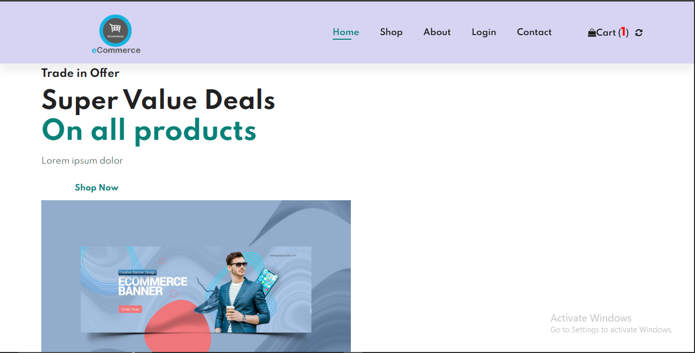

# 🚀 AWS EKS Hosted Website

This project demonstrates how to host a personal website on **AWS EKS (Elastic Kubernetes Service)** using Docker containers, Amazon ECR, EC2 worker nodes, a Load Balancer, and Route 53 for domain management.

---

## 📌 **Project Overview**

The goal of this project is to understand and deploy a **containerized website** on a managed Kubernetes cluster using AWS services.  
The entire workflow is designed to be simple, scalable, and a solid foundation for future improvements like CI/CD, monitoring, or autoscaling.

---

## ✅ **Key Steps**

1. **Source Code:** Website source code is version-controlled in a private **GitHub repository**.
2. **Containerization:** The site is packaged into a **Docker image** built locally on a Linux machine.
3. **Image Registry:** The Docker image is pushed to **Amazon ECR** (Elastic Container Registry).
4. **Cluster:** An **EKS cluster** is provisioned, with **EC2 worker nodes** handling the container workloads.
5. **Deployment:** The Docker container is deployed to EKS using `kubectl` and Kubernetes YAML manifests.
6. **Load Balancer:** An **AWS Load Balancer** is automatically created to expose the application to the internet.
7. **DNS:** **Route 53** is configured to point a custom domain to the Load Balancer.

---

## 🗂️ **Project Images**

Below are some snapshots showing the setup and architecture:

### 📌 Website Flow & Deployment

### 📌 AWS Load Balancer

### 📌 Route 53 Hosted Zone

---

## ⚙️ **Tools & Services Used**

- **AWS EKS** – Managed Kubernetes control plane
- **Amazon EC2** – Worker nodes for running pods
- **Amazon ECR** – Secure Docker image storage
- **Docker** – Container build and local testing
- **kubectl** – Kubernetes CLI for deployment
- **AWS Load Balancer** – Exposes the pods to the public
- **Amazon Route 53** – DNS management for domain routing

---

## 📈 **Project Status**

✅ **Current Status:** Ongoing  
🔗 **Live URL:** *Coming Soon*  
📌 The repo and deployment files are under development and will be refined for better automation and scaling.

---

## 🤝 **Contributions & Feedback**

This project is primarily for learning purposes — feel free to clone, fork, or suggest improvements through pull requests or issues.

---

## 📬 **Contact**

If you have questions or suggestions, feel free to open an issue or connect with me on [LinkedIn](https://www.linkedin.com/in/aryan-sharma-a2a240353/?utm_source=share&utm_campaign=share_via&utm_content=profile&utm_medium=android_app).

---

**Thank you for checking out this project!**

---

**#AWS #EKS #Kubernetes #Docker #DevOps #InfrastructureAsCode**
